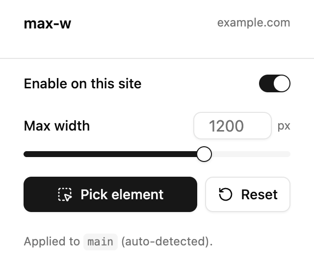
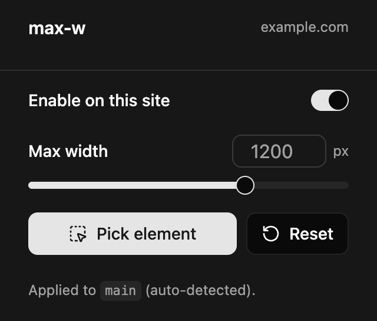

# max-w

A Chrome extension that gives wide web pages a comfortable **maximum reading width**.

Many sites — especially older blogs — let their main content stretch edge-to-edge, so
on a wide monitor the text runs in very long, hard-to-read lines. **max-w** adds the
missing container: it caps the content width and centers it, so lines stay a
comfortable length. It's **opt-in per site**, skips pages that already have a
container, and lets you pick the container element yourself when the automatic guess
is wrong.


## Screenshots

| Light | Dark |
| --- | --- |
|  |  |

## Features

- **Opt-in per site** — does nothing until you enable it for a site; your choice is saved.
- **Automatic detection** — finds the main content (`main`, `article`, etc.) and applies a width.
- **Skips contained pages** — leaves sites that already have a sensible max-width alone.
- **Manual element picker** — click the exact element you want to constrain.
- **Adjustable width** — set the max width per site with a slider.
- **Scrollbar-safe** — keeps the page's scrollbar at the viewport edge.
- **Syncs** across your signed-in Chrome profiles via `chrome.storage.sync`.

## Install

### From a release (recommended)

1. Download `max-w.zip` from the [latest release](https://github.com/TimSchulzRC/max-w/releases/latest) and unzip it.
2. Open `chrome://extensions`.
3. Enable **Developer mode** (top-right).
4. Click **Load unpacked** and select the unzipped folder.

### From source

```bash
git clone https://github.com/TimSchulzRC/max-w.git
cd max-w
npm install
npm run build
```

Then load the generated **`dist/`** folder via **Load unpacked** as above.

## Usage

1. Open a page whose content runs too wide.
2. Click the **max-w** toolbar icon.
3. Flip **Enable on this site** — the content snaps to a centered, readable column.
4. Optional: drag **Max width** to taste, or click **Pick element** and click the
   element you want to constrain if the automatic pick isn't right.
5. **Reset** clears your settings for the current site.

Your per-site settings persist across sessions.

## How it works

max-w is a Manifest V3 extension with two parts:

- A **content script** runs on each page. If the site is enabled, it detects the main
  content element (or uses your picked selector), checks it isn't already constrained,
  and injects a `max-width` rule.
- A **popup** (React + Tailwind + shadcn/ui) is the UI. It talks to the content script
  via `chrome.runtime` messages to read state and apply changes.

Settings live in `chrome.storage.sync`, keyed by hostname.

## Development

```bash
npm install
npm run dev     # Vite watch mode + hot reload (load the dist/ folder once)
npm run build   # production build into dist/
npm run icons   # regenerate the PNG icons
```

The stack is Vite + [`@crxjs/vite-plugin`](https://crxjs.dev/), React, TypeScript, and
Tailwind v4 with shadcn/ui. `manifest.json` is the source manifest; the plugin bundles
everything into `dist/` and rewrites the manifest for you.

```
manifest.json          source manifest (bundled into dist/)
src/
  content.ts           detection, applying the container, the element picker
  lib/                 storage helpers + typed message contract
  components/ui/       shadcn components
  popup/               the popup UI
icons/                 extension icons
scripts/               icon generator
```

## Contributing

Issues and pull requests are welcome. Please run `npm run build` (which typechecks via
`tsc`) before opening a PR.

## Support

If you find max-w useful, you can support its development:

[](https://buymeacoffee.com/timschulz)

## License

[MIT](LICENSE) © Tim Schulz
